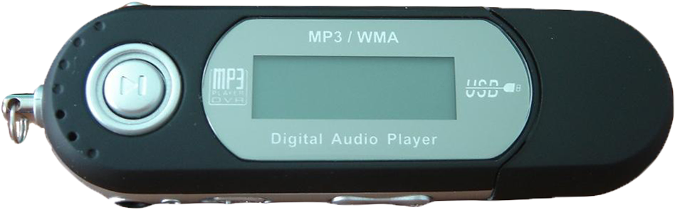

# MP3



MP3 is a small tool that offers a CLI similar to that of [pm2](https://github.com/Unitech/pm2),
but instead of running a daemon to manage processes, it just creates systemd service files,
and forwards commands to systemd and the systemd joural.

It can be used to quickly start apps and keep them running forever, restarting them after reboot or failure. It also
provides a nice
interface to check the status of running apps, and see their logs.

MP3 also contains some tools for an opinionated workflow of connecting apps to a Caddy reverse proxy and some other
convenience functions.

## Installation

MP3 is written in Go and can be distributed as a single binary executable.

1. Build using `go build -o mp3` or download a prebuilt binary
2. Move the `mp3` executable to the desired directory
3. Add this directory to the PATH environment variable
4. Verify that you have execute permission on the file

## Usage

### Start an app

Simplest way to daemonize a node app (just like pm2)

```shell
mp3 start app.js
```

Starting other application types

```shell
mp3 start bashscript.sh
mp3 start python-app.py
mp3 start ./binary-file -- --port 1520
```

For python and node scripts a default interpreter will be set,
but you can also specify it with the `--interpreter` flag.

pm2 compatible flags for `start`:

```shell
# Specify a name for the app
-n --name <app_name>

# Pass extra args to the app
-- arg1 arg2 arg3

# Delay between automatic restarts
--restart-delay <delay in ms>

# Do not auto restart app
--no-autorestart
```

Unlike pm2, mp3 will enable apps when started, so they get automatically started on startup as as well. To disable this
behaviour, you can use the `--create-only` flag described below

mp3 specific flags

```shell
# Only create a service file, do not start and enable
--create-only
```

After an application has been started once, you can always start it again from anywhere with `mp3 start <name>`.

### Managing processes

```shell
mp3 restart app_name
mp3 reload app_name
mp3 stop app_name
mp3 delete app_name
```

For all commands except delete you can also pass 'all' instead of an app name.

### Status & Logs

You can display the status of all mp3 services

```shell
mp3 [list|ls|status]
```


Display the logs for all mp3 services

```shell
mp3 logs
```

or for a specific app

```shell
mp3 logs <app_name>
```

If you want to filter logs or change the they are displayed, you can pass
on any arguments to `journalct` with `--`, but please do not change the output format, otherwise MP3 will not parse it
correctly.

### Configuring services

MP3 only sets up systemd unit files with a base configuration for you. If you want more control, or you want to change
the config
of an existing service, you are expected to edit the unit file yourself.

MP3 provides a shortcut to edit unit files with
nano and reload the daemon:

```
mp3 config app_name
```

### Adopting existing systemd services

MP3 lets you add existing systemd services into the MP3 namespace, so you can manage them via the MP3 CLI.

Example:

```
mp3 adopt caddy
```

Always use just the name of the service, without the `.service` suffix when interacting with it via MP3.

### Connecting with Caddy

MP3 Is mainly intended for managing web-apps, it has some special functions to interact with
the [Caddy web server](https://caddyserver.com/),
and simplify setting up reverse proxies to running apps.

Before using connect, you need to [install Caddy](https://caddyserver.com/docs/install), and configure it using MP3:

```
mp3 setup caddy
```

This will convert your `/etc/caddy` directory to the following structure:

```
── /etc/caddy
   ├─ Caddyfile   ← Caddyfile to import everything in sites/
   ╰─ /sites
      ├─ default.conf      ← any old existing Caddyfile
      ├─ site.b.com.conf
      ├─ site.b.com.conf   ← mp3 will create conf files for apps like this
      ├─ site.c.com.conf
      ╰─ other.net.conf    ← extra conf files for static sites etc.
```

Now you can connect an app to a domain pointed at your server like so:

```
mp3 connect example-app app.example.com
```

MP3 will find the port of your running app, and set up a reverse proxy caddyfile for you, so
that https://app.example.com
routes to your mp3 app `example-app`.

You can also generate other types of caddyfiles in the `/sites` directory quickly with mp3

```
# Set up a static file server for example.com
mp3 connect STATIC example.com

# Set up an SPA-compatible file server for example.com
mp3 connect SPA example.com
```

# ToDo

- [ ] Notifications on app failure / start 
